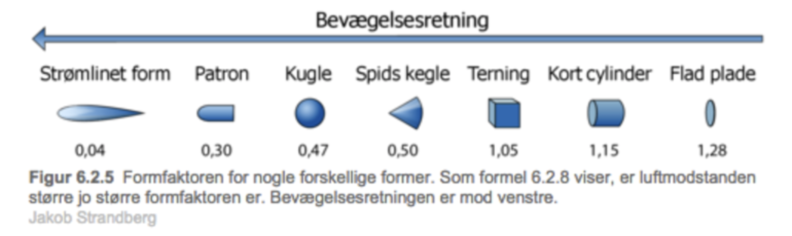
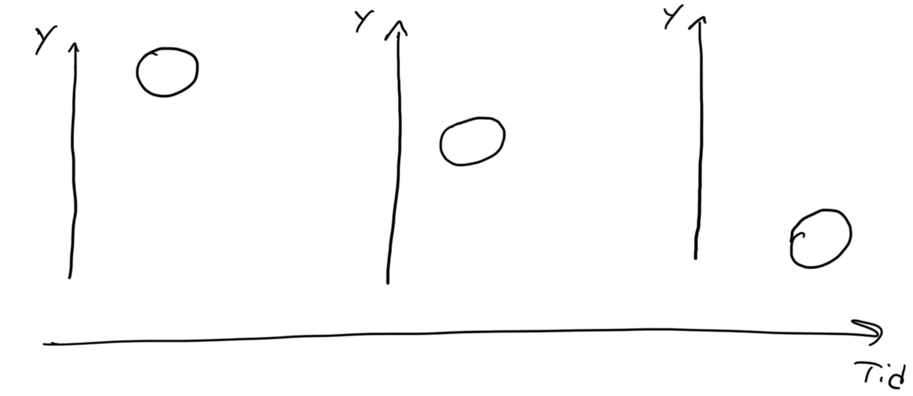

Vi skal se på luftmodstanden som den vigtigste modifikation til frit fald. Luftmodstanden kan skrives som 
$$F_{luft} = 0.5\cdot c_w \cdot \rho_{luft}\cdot A \cdot v^2$$
Den afhænger altså af hastigheden i anden, arealet i bevægelsesretningen, luftens densitet som er ca $$\rho_{luft} = 1,225kg/m^3$$ ved jordoverfladen.
c_w kaldes formfaktoren og angiver hvor meget eller lidt strømlinet man er. Her er nogle typiske værdier for formfaktoren

Den resulterende kraft bliver
$$
F_{res}  = m\cdot g-0.5\cdot c_w \cdot \rho_{luft}\cdot A \cdot v^2
$$

Newtons anden lov giver os accelerationen
$$a = F_{res}/m $$ 

eller hvis man skriver accelerationen som den differentierede af hastigheden. 
$$v'(t) = g-1/m\cdot 0.5\cdot c_w \cdot \rho_{luft}\cdot A \cdot v^2 $$
Dette er en ikkelineær differentialligning og kan generelt ikke løses eksakt. Det er derfor at vores tilgang med numerisk løsning virker så godt her.

Vi skal finde bevægelsen og tilføje den modificerede acceleration.

Før vi gør noget andet prøver vi at sætte 
$$k = 0.5\cdot c_w \cdot \rho_{luft}\cdot A$$ 
så udfrykket for kraften bliver

$$F = m\cdot g-k\cdot v^2.$$

Nedenfor er en simulation af en bold tabt fra 20 meter med en masse på 1kg og en diameter på 10cm. Det giver en $(k=0.1)$, hvis man indsætter i ligningen ovenfor.  

[https://glowscript.org/#/user/mps/folder/baumgartner/program/luftmodstand](https://glowscript.org/#/user/mps/folder/baumgartner/program/luftmodstand)

* Beskriv hvordan boldens hastighed ændrer sig.
* Lad bolden starte højere oppe og beskriv igen hastigheden.

Her vises en tegneserie med boldens placering, før den rammer jorden. 

* Lav selv en tegning og brug jeres simulering af boldens hastighed til at indtegne kraftpile på de tre bolde. 
* Hvad må der gælde for kraftpilene på den sidste bold, hvor hastigheden er konstant?

Den konstante hastighed bolden opnår kaldes **terminalhastigheden**.

### Definition af terminalhastigheden

* Lav selv en definition af terminalhastigheden hvor I bruger begreberne **kraft** og **hastighed**.

* Undersøg hvad der sker når bolden har en hastighed større end terminalhastigheden.
* Ændrer det sig hvis starthastigheden er positiv eller negativ (op eller ned)?

Ved bevægelse uden luftmodstand kom I frem til at boldens bevægelse var uafhængig af boldens masse, men gælder det også nu når vi har luftmodstand med?

* Undersøg hvordan boldens terminalhastighed ændrer sig når massen og k ændres, ( husk variabelkonteol).

Felix Baumgartner var ikke en kugle, men nok noget mere strømlignet. De ting vi kan ændre på i simuleringen er massen, m, arealet, A, og formfaktoren c. De tre størrelser er ikke kendte og I bliver nød til at lave rimelige gæt.

* Undersøg om Baumgartner kan nå terminalhastighed ved at komme med et bud på størrelsen af de tre variable og sæt dem ind i simuleringen. Det kan være I skal se videoen igen.
* Diskuter hvordan I vil ændre størrelsen af variablene for at komme tættere på lydens hastighed.
* Kom frem til den kombination af m, A, c som I synes er mest realistisk og vurder hvor realistisk den er.

### Hvorfor virker faldskærme

Antag, at en faldskærm har en formfaktor på $(c_w=1.2)$ og et areal på $(A=26\text{m}^2)$
* Find terminalhastigheden med faldskærm og diskuter om det er ok at lande med sådan en.

### Egne spørgsmål
I har nu arbejdet med en model af en bold som bevæger sig i et tyngdefelt, hvor en konstant tyngdekraft og luftmodstanden påvirker bolden. I skal nu overvej hvad man kan undersøge med denne model.

* Kom med forslag til ting som kunne være interessante at undersøge, og hvad undersøgelsesspørgsmålet skulle være.
* Kom med et bud på hvad der skal ændres i modellen ( I behøver ikke implementerer det i koden).
* Hvis I kan, så prøv at implementer en enkelt ide og se om I kan besvare jeres spørgsmål.

### Forsøg: red Barbie
Barbie, eller en anden legetøjsfigur, er helt uskyldigt blevet tvunget op i en flyver af en ond skurk, måske endda en superskurk, og den eneste måde at redde sig selv er at kaste sig ud. Hun har heldigtvis mulighed for at lave en faldskærm. I skal nu udviklen og teste en faldskærm til Barbie. 

Det overordnede spørgsmål er **Hvad skal der til for at Barbie overlever faldet**.

* I skal selv lave en række underspørgsmål, I skal besvare for at svare på hovedspørgsmålet.
* Design en faldskærm.
* Argumenter for at den virker, hvor I bruger simulering.
* Udfør forsøg hvor I tester faldskærmen, med videoanalyse.
* Diskuter om resultaterne af forsøget og simuleringen stemmer over ens.

