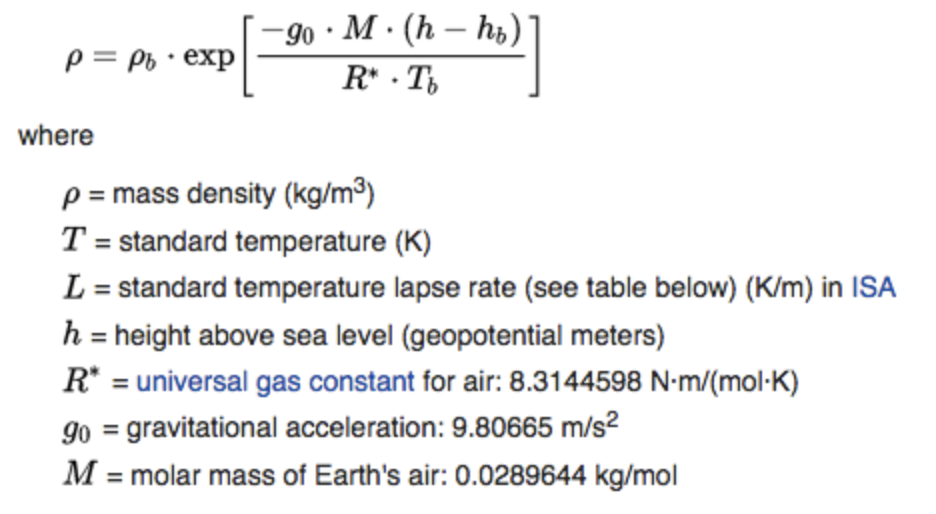

### Indholdsfortegnelse

* [Introduktion](https://mpsteenstrup.github.io/baumgartner/introduktion)
* [Frit fald](https://mpsteenstrup.github.io/baumgartner/fritfald)
* [Luftmodstand](https://mpsteenstrup.github.io/baumgartner/luftmodstand)
* [Atomsfærens densitet](https://mpsteenstrup.github.io/baumgartner/atmosfaere)
* [Den fulde model](https://mpsteenstrup.github.io/baumgartner/fulde-model)

basal programmering

* [Grundelementer i programmering](https://mpsteenstrup.github.io/baumgartner/former)
* [Former](https://mpsteenstrup.github.io/baumgartner/basal-programmering)
* [Bevægelse](https://mpsteenstrup.github.io/baumgartner/bevaegelse)

# Atmosfærens densitet

Det kan vises at atmosfærens densitet aftager eksponentielt. Det er ikke en beregning vi vil gå ind i men formlen er
$$\rho = \rho_0\cdot e^{-0.0001166\cdot h}$$, hvor h er højden. $$\rho_0 = 1,2250kg/m^3$$ ved havoverfladen. 

ok her er formlen rigtigt

Vi vil nu gerne lave en (h,rho) graf

[https://glowscript.org/#/user/mps/folder/baumgartner/program/atmosfaere](https://glowscript.org/#/user/mps/folder/baumgartner/program/atmosfaere)

og det var så højden.

* sammenlign med den grønne graf fra RedBull, hvordan får du x-aksen til at være den samme som i simulationen?
