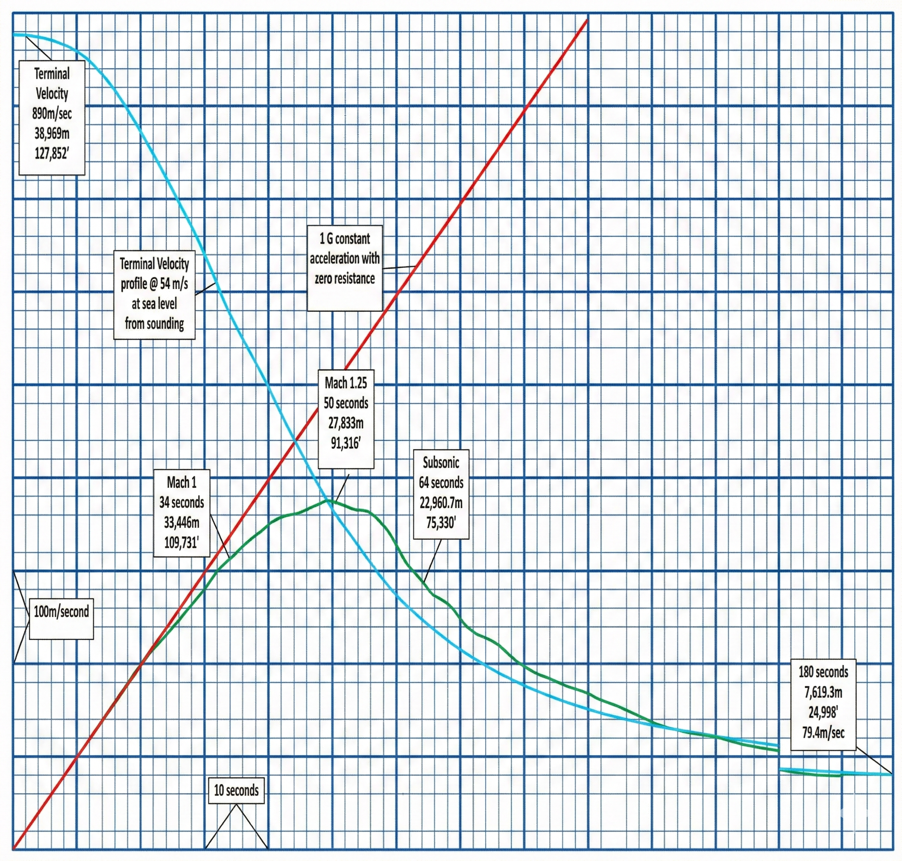

### Indholdsfortegnelse

* [Introduktion](https://mpsteenstrup.github.io/baumgartner/introduktion/)
* [Frit fald](https://mpsteenstrup.github.io/baumgartner/fritfald/)
* [Luftmodstand](https://mpsteenstrup.github.io/baumgartner/luftmodstand/)
* [Atomsfærens densitet](https://mpsteenstrup.github.io/baumgartner/atmosfaere/)
* [Den fulde model](https://mpsteenstrup.github.io/baumgartner/fulde-model/)

basal programmering

* [Grundelementer i programmering](https://mpsteenstrup.github.io/baumgartner/former/)
* [Former](https://mpsteenstrup.github.io/baumgartner/basal-programmering/)
* [Bevægelse](https://mpsteenstrup.github.io/baumgartner/bevaegelse/)

# Introduktion

Vi vil prøve at lave en matematisk model til at beskrive Felix Bamugartners hop, hvor han brød lydmuren. 

Hoppet kan ses her [Felix Baumgartner jump](https://youtu.be/vvbN-cWe0A0)

Det data vi skal sammenligne med er fra Red Bull Strata.

* Beskriv den grønne graf.
* Hvad der hans makshastighed.
* Hvad viser den røde linje.
* Hvad viser den lysegrønne.

Her er data, men det er sjovere at finde dem selv - ud fra grafen.
[tid_hastighed.txt](billeder/tid_hastighed.txt)

ScienceWorld har også lavet en fil med lidt flere datapunkter, https://www.scienceworld.ca/. , her er filen [Baumgartner.csv](/api/files/63fcd3c49eac33ba4aae5609/baumgartner.csv "Baumgartner.csv")

